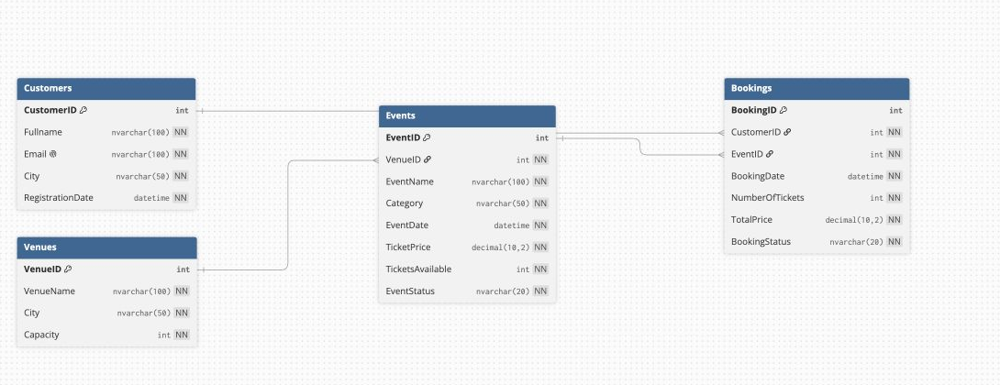
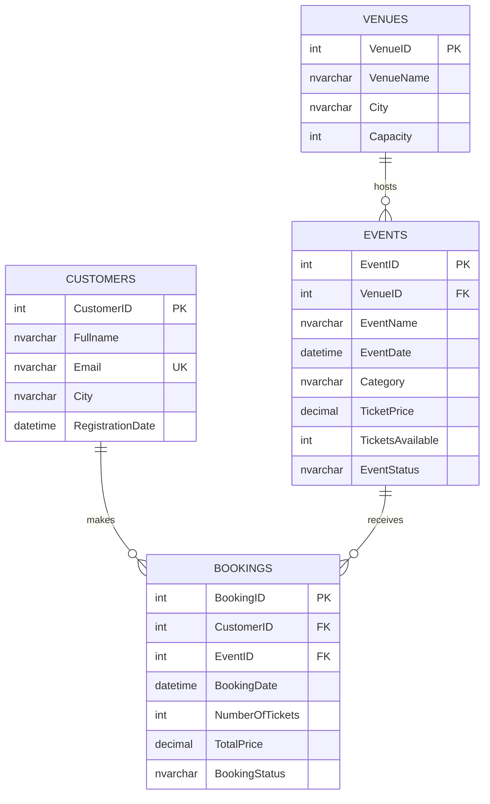

# TicketFlowDB

An SQL Server portfolio project for a fictional event-ticketing business. The
project demonstrates the database design and data-manipulation skills completed
in Module 1 of *Data Manipulation and Transactions in SQL Server*.

## Project status

Completed through Stage 7:

- Database and table creation
- Relational keys and validation constraints
- Fictional sample-data insertion
- Data retrieval and filtering
- Joins, sorting, `TOP` and `DISTINCT`
- Targeted, verified `UPDATE` operations
- Safe, targeted `DELETE` operations
- Foreign-key protection demonstration
- Eight final business-question queries

## Business scenario

TicketFlow manages customers, venues, events and ticket bookings. The database
allows staff to register customers, schedule events, track ticket availability,
record bookings and maintain accurate event information.

## Database design





## Technologies

- Microsoft SQL Server
- T-SQL
- Docker Desktop
- Visual Studio Code
- SQLTools

## Repository structure

| File | Purpose |
|---|---|
| `01_create_database_and_tables.sql` | Creates TicketFlowDB, tables, relationships and constraints |
| `02_insert_sample_data.sql` | Adds fictional customers, venues, events and bookings |
| `04_select_queries.sql` | Contains ten retrieval and filtering exercises |
| `05_update_queries.sql` | Demonstrates six targeted updates with before-and-after verification |
| `06_delete_queries.sql` | Demonstrates a safe test-record deletion and foreign-key protection |
| `07_business_questions.sql` | Answers all eight final business questions |
| `TicketFlowDB_ER_Diagram.png` | Visual ER diagram of the four related tables |
| `Portfolio-Guide.pdf` | Original guided project brief |

## How to run

1. Start SQL Server.
2. Connect through VS Code.
3. Run `01_create_database_and_tables.sql`.
4. Run `02_insert_sample_data.sql` once.
5. Run `04_select_queries.sql`.
6. Run each exercise in `05_update_queries.sql` once.
7. Run sections 6.1 and 6.2 in `06_delete_queries.sql` together once.
8. Run the eight queries in `07_business_questions.sql`.

Do not rerun the sample-data script against a populated copy of the database,
because unique email constraints will correctly reject duplicate customers.
The foreign-key test in Stage 6 is commented out so it can be highlighted and
run separately when you want to capture the expected protection error.

## Skills demonstrated

- `CREATE DATABASE` and `CREATE TABLE`
- Identity primary keys
- Foreign-key relationships
- `NOT NULL`, `UNIQUE`, `DEFAULT` and `CHECK` constraints
- Multi-row `INSERT`
- `SELECT`, `WHERE`, `ORDER BY`, `TOP` and `DISTINCT`
- Inner joins between customers and bookings
- Safe `UPDATE` operations using precise conditions
- Safe `DELETE` operations using precise conditions
- Foreign-key protection for related records
- Before-and-after verification queries
- ISO date-time values for reliable SQL Server input

## Example: bookings with two or more tickets

```sql
SELECT
    b.BookingID,
    b.CustomerID,
    c.Fullname,
    b.NumberOfTickets,
    b.TotalPrice
FROM Bookings AS b
JOIN Customers AS c
    ON b.CustomerID = c.CustomerID
WHERE b.NumberOfTickets >= 2
ORDER BY b.NumberOfTickets DESC;
```

## Learning reflection

This project strengthened my understanding of relational database design and
safe data manipulation. I learned how primary and foreign keys protect table
relationships, why identity columns should be generated by SQL Server, and why
every update or deletion should be checked with a targeted `SELECT` before and
after it runs.

## Next steps

- Add integrity-check queries
- Capture result screenshots
- Extend the project with transactions and ACID compliance in Module 2
